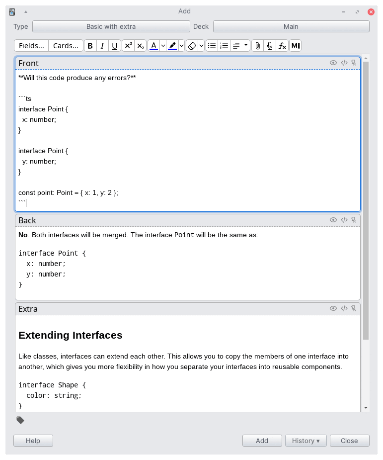

    

<h1 style="margin-top: 0;" align="center">GitHub Markdown</h1>

This addon allows you to create cards using Markdown. It will use the GitHub API, which means you can use GitHub CSS to style your cards. For this, you can use our card styles or create yours.

    

## Development and contributing

Please, consider read the [CONTRIBUTING.md](CONTRIBUTING.md) before submit a PR.
