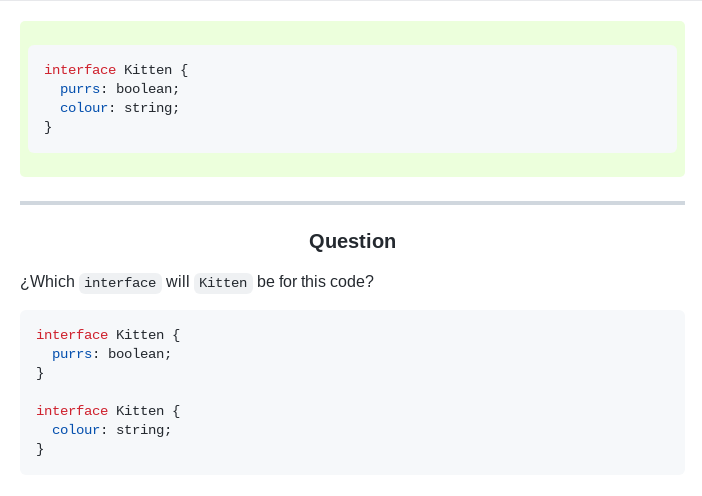

# CSS Files

This directory contains CSS for your Anki cards. This CSS applied to the converted Markdown created by GitHub will make your cards look awesome.

## How to use

1. Copy the CSS code from the file you want to use.
2. Copy it into the "Styling" section of the card editor in Anki.

## Styles

| [**Basic**](main/) |   |
| ------------------ | --------------------------------------------------------------------------------------------------------------------- |

## Contributing

We are open to have different styles for the cards. Don't hesitate to create a pull request with your own style. We will be happy to introduce it here.
